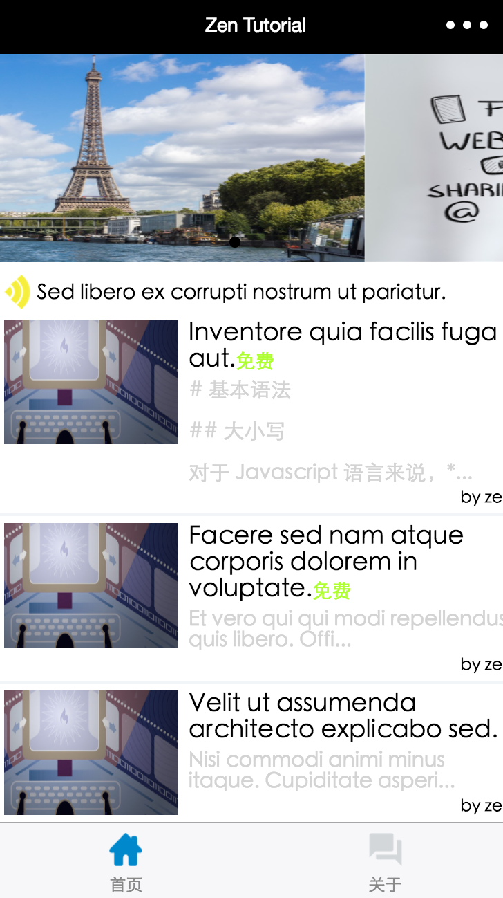

# 小程序课程网站 Demo

预览

实现：小程序 + Laravel Api （Dingo + Jwt）

功能：

* 通知滚动轮播
* 课程列表分页显示 - `scroll-view` 上拉下拉实现
* 课程详情页面  - 使用 `wxParse` 编译 `markdown`
* 收费课程权限管理 - 收费课程需要登录后才能观看

鸣谢：

[9 小时搞定微信小程序开发 - StuQ](http://www.stuq.org/course/1166/study)
